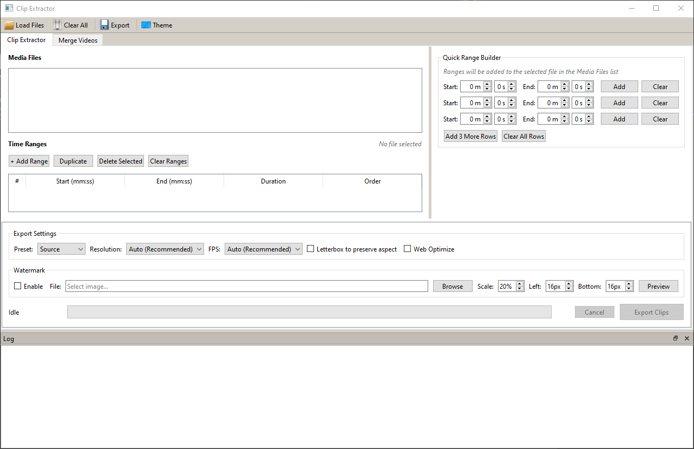

# pyClipExtractor

A desktop application for extracting, trimming, and merging video clips with watermark support.



## Features

- **Clip Extraction** - Extract multiple time ranges from videos into a single output
- **Video Merging** - Combine multiple video files into one seamless video
- **Watermark Support** - Add image watermarks with customizable position and scale
- **Quality Presets** - Source, High, Medium, and Social/Light encoding options
- **Resolution Control** - Output at Source, 4K, 1440p, 1080p, 720p, or 480p
- **FPS Options** - Auto, 23.976, 24, 25, 29.97, 30, 50, 59.94, or 60 fps
- **Letterboxing** - Preserve aspect ratio with black bars
- **Web Optimization** - Fast-start encoding for web streaming
- **Dark/Light Theme** - Toggle between themes

## Quick Start

### Requirements

- Python 3.10+
- FFmpeg (ffmpeg.exe, ffprobe.exe, ffplay.exe)

### Installation

1. Clone the repository
   ```bash
   git clone https://github.com/ZxPwdz/pyClipExtractor.git
   cd pyClipExtractor
   ```

2. Install dependencies
   ```bash
   pip install -r requirements.txt
   ```

3. Download [FFmpeg](https://ffmpeg.org/download.html) and place the executables in the project folder

4. Run the application
   ```bash
   python main.py
   ```

**Windows Users:** Double-click `run_clip_extractor.bat` to auto-install dependencies and launch.

## Usage

### Clip Extractor Tab

1. **Load Videos** - Click "Load Files" or press `Ctrl+O`
2. **Add Time Ranges** - Use the Quick Range Builder to define start/end times
3. **Configure Settings** - Choose preset, resolution, FPS, and watermark options
4. **Export** - Click "Export Clips" or press `Ctrl+E`

### Merge Videos Tab

1. **Add Files** - Click "Add Files" to select videos
2. **Arrange Order** - Use "Move Up" / "Move Down" to reorder
3. **Configure Settings** - Choose resolution and web optimization
4. **Merge & Export** - Click "Merge & Export" to combine videos

## Keyboard Shortcuts

| Shortcut | Action |
|----------|--------|
| `Ctrl+O` | Load Files |
| `Ctrl+E` | Export Clips |
| `Delete` | Delete Selected Segments |

## Export Presets

| Preset | CRF | Speed | Audio | Use Case |
|--------|-----|-------|-------|----------|
| Source | 20 | medium | 192k | Archival quality |
| High | 18 | slow | 320k | Best quality |
| Medium | 22 | medium | 192k | Balanced |
| Social/Light | 27 | faster | 128k | Small file size |

## Supported Formats

**Input:** MP4, MOV

**Output:** MP4 (H.264/AAC)

## Tech Stack

- **Python** - Core language
- **PySide6** - Cross-platform GUI framework
- **FFmpeg** - Video processing engine

## License

MIT License - Feel free to use, modify, and distribute.

---

Created by **ZxPwdz**
